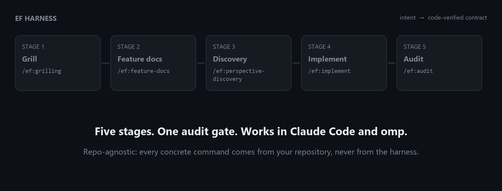
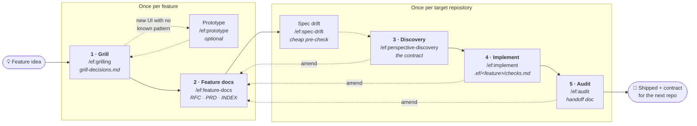
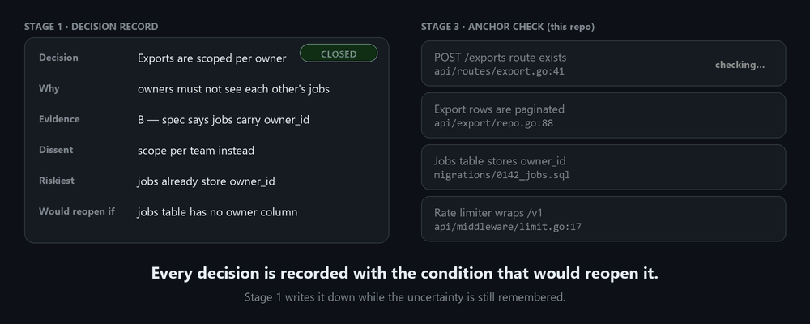
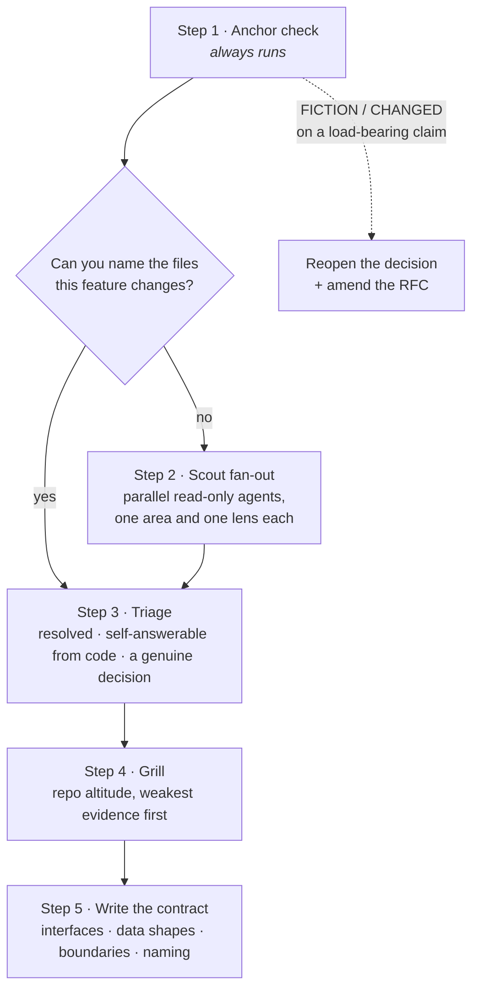
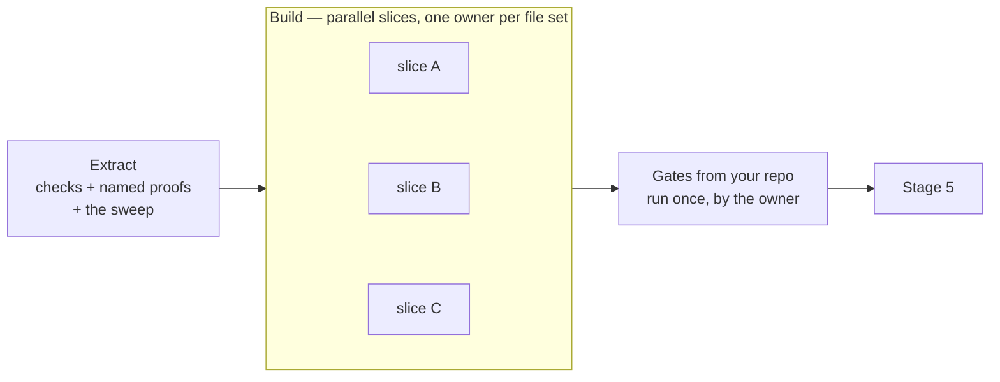
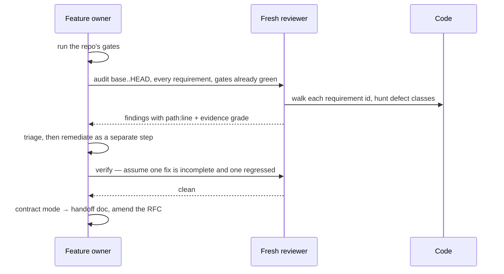
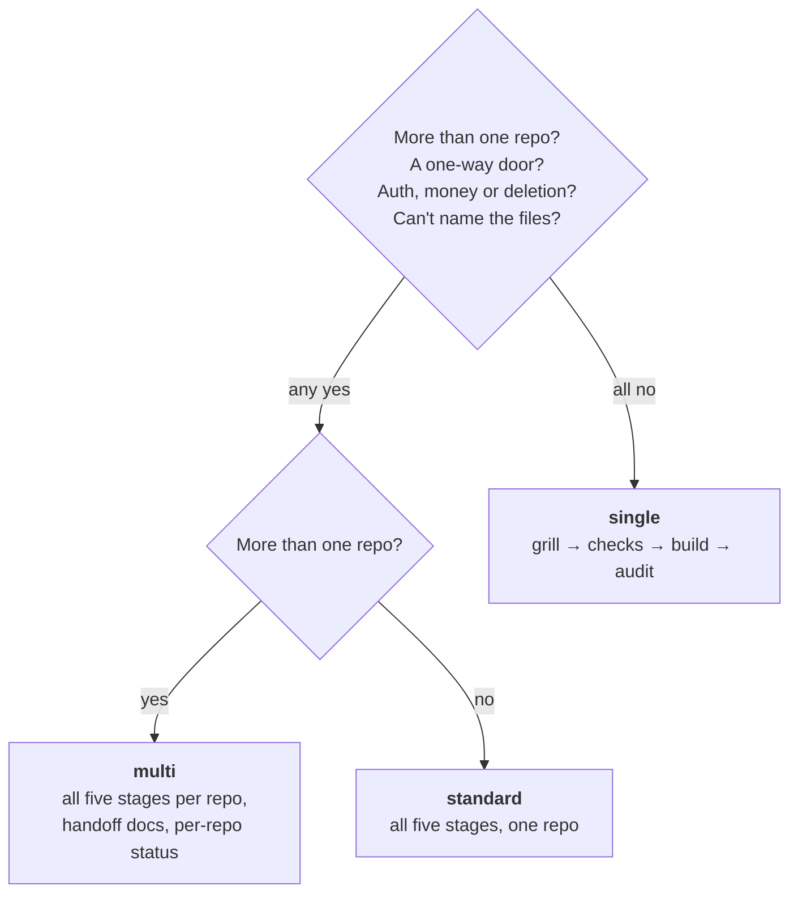

<div align="center">

# EF Harness

**Take a feature from raw intent to a code-verified contract — with an AI agent that has to prove
what it built.**

[](CHANGELOG.md)
[](LICENSE)
[](#claude-code)
[](#omp)
[](#bindings--the-only-place-your-stack-appears)



</div>

---

## Why this exists

Coding agents are very good at producing code and very bad at knowing whether it was the *right*
code. In practice a feature built with an agent fails in a handful of predictable ways:

| What goes wrong | Why it happens |
|---|---|
| The agent builds a confident implementation of an **undecided** requirement | Nobody forced the decision; the agent filled the gap with something plausible |
| The spec is **wrong about the code** and nobody notices until review | Specs are written at product altitude, often before the code exists, by someone who could not see the repo |
| "All tests pass" — and the feature is still broken | The tests were written by reading the implementation, so they assert what the code *does*, not what it *should* do |
| The agent says it's done, and verifies itself | The author of a change has the same blind spots as the change |
| The second repository builds against the design, not what shipped | Nobody wrote down where the implementation diverged |

EF is a set of commands and skills that turns those failure modes into **gates**. It does not make
the agent smarter. It makes the agent's mistakes surface early, cheaply, and in writing.

## What you get

- 🔨 **Decisions before code.** Stage 1 is a relentless, one-question-at-a-time interview. Every
  decision is recorded with its evidence, the option that lost, the riskiest assumption, and the
  exact condition that would reopen it.
- 🔍 **Docs are claims, not truth.** Before a line is written, every code anchor the docs mention is
  checked against the real repository — `VERIFIED`, `MOVED`, `CHANGED` or `FICTION`.
- ♻️ **Self-correcting decisions.** A false anchor that matches a decision's `Would reopen if`
  condition reopens that decision *by its own stated terms* — no debate about whether it matters.
- ✅ **Named proofs.** Every implementation check names the specific test whose exit code settles
  it. "The suite is green" is not a proof.
- 🧑‍⚖️ **One adversarial audit gate.** A fresh reviewer, dispatched over the whole feature range,
  assumes the work is wrong until the code says otherwise. Builders never verify themselves.
- 📜 **Living documents.** The RFC and PRD are amended in place by Stages 3, 4 and 5, so the next
  repository reads what actually shipped.
- 🧩 **Any stack.** No language, test runner or directory layout is assumed. Your repository
  declares its own gates once; the harness never invents a command.
- 🔌 **Two tools, one tree.** The same files are a Claude Code plugin and an omp plugin.
- ⚖️ **Priced shortcuts.** Small features skip steps — and each shortcut names exactly which class of
  failure it stops catching.

---

## Quick start

### Claude Code

```text
/plugin marketplace add micaelcf/ef-harness
/plugin install ef@ef-harness
```

### omp

```bash
omp plugin marketplace add micaelcf/ef-harness
omp plugin install ef@ef-harness                  # every project
omp plugin install --scope project ef@ef-harness  # or just this one
```

### Your first feature

```text
/ef:grilling  "Users can export their audit log as CSV"
```

Answer the questions. When the decisions are closed, the grill tells you the next command — and so
does every stage after it.

---

## How it works



| Stage | Command | Runs | Produces | Why it is a separate stage |
|---|---|---|---|---|
| 1 | `/ef:grilling` | once per feature | `grill-decisions-<date>-<feature>.md` | An undecided requirement is the most expensive bug there is, and it is invisible in code review |
| 2 | `/ef:feature-docs` | once per feature | `RFC` · `PRD` · `INDEX` | Written *from* the decisions, never beside them, so the documents cannot drift from what was agreed |
| 3 | `/ef:perspective-discovery` | per target repo | the contract | The docs were written without seeing this repo; this is where they meet it |
| 4 | `/ef:implement` | per target repo | `.ef/<feature>/checks.md` | Checks and proofs are fixed **before** code, so they are a bar to build under, not a rationalisation |
| 5 | `/ef:audit` | per target repo | the handoff doc | The only gate. A fresh agent, the whole feature, every requirement |

### Stage 1 — Grill: close the decisions

The grill asks **one question at a time** — batching produces worse answers, because the human
optimises for getting through the list. Every question is grounded in something it read, carries an
evidence grade, offers 2–4 real options with their costs, and makes a recommendation.

It also guards its own reasoning — sycophancy, anchoring, sunk cost, confirmation bias — because the
failure mode of an agent interview is not disagreement, it is agreement.

Every closed decision takes the same shape, and **every field is consumed downstream**:

```text
Decision · Why (ranked) · Evidence grade · Dissent · Riskiest assumption · Test · Would reopen if · Supersedes
```

- `Dissent` becomes the RFC's rejected-options row — invented later, it would be a fake comparison
  written by someone who already knows the answer.
- `Riskiest assumption` + `Test` + `Would reopen if` become the RFC's assumptions table.
- `Would reopen if` is what makes Stage 3 self-correcting:

<div align="center">

<br/><sub>Illustrative example — the files and claims are made up.</sub>
</div>

A question nobody in the room can answer yet is recorded as **still open**, with what it is blocked
on. A coerced decision gets written into an RFC, built into a contract, and discovered to be hollow
three stages later; an honest open question costs one line.

### Stage 2 — Feature docs: transcribe, don't re-decide

```text
grill-decisions  →  RFC  →  PRD  →  INDEX
```

Each document is written from the one before it. Nothing mandatory is ever filled with invented
content — missing values are asked for, and anything unresolved goes to `## Open questions` with an
owner. A placeholder that looks like content is the one failure this stage must not produce.

### Stage 3 — Discovery: the docs meet the code



Scouts get **different critical lenses** — assumption-surfacing, pre-mortem, red-team,
evidence-audit, second-order — because parallel readers using the same method produce correlated
reports, and the fan-out buys nothing.

The contract is written by the agent that holds the whole feature, into a **file**. Parallel slices
cannot read a conversation, and anything left for them to negotiate will diverge.

### Stage 4 — Implement: proofs first, then build



- **Refuse rather than guess.** Every check needs a nameable proof, a concrete value, and a stated
  boundary. A vague check becomes a vague assertion that passes.
- **The sweep** walks thirteen requirements nobody writes down — authorization, idempotency,
  concurrency, the error contract, data lifecycle, schema provenance and more — and forces an answer
  for each. "Already covered by X" is an answer. Silence is not.
- **Tests assert the check, never the implementation.** No weakening assertions, no skipping, no
  deleting to go green.

### Stage 5 — Audit: the single gate



The auditor hunts the defects that **survive a green suite**: tests that would still pass if the
behaviour reverted, destructive defaults on omitted fields, nil-versus-empty, signals that mean two
things. A finding graded C or D is reported as a question, never a blocker.

The handoff document is written **from the code**, not from the design, and lists its divergences
from the spec first — it is the only section a consumer cannot afford to skim.

---

## Scale: pay only for what you need



| Scale | What you skip | What it can no longer catch |
|---|---|---|
| `single` | RFC + PRD collapse into one `DECISIONS_<feature>.md`; no fan-out | a convention of this repo you do not know about; anything a second reader would have seen |
| `standard` | cross-repo apparatus | cross-repo contract drift — there is no second repo to drift from |
| `multi` | nothing | nothing structural; this is the complete pipeline |

Stage 1 declares the scale once and every stage inherits it; a repo may raise it for itself, never
lower it. **The audit never collapses** — it runs at every scale.

Two optional steps are decided by the same question — *can you name the thing you are copying?*

| Optional step | Runs when |
|---|---|
| `/ef:prototype` | the feature introduces a screen that is **not** a variation of an existing one or a well-known pattern. Produces 4–5 genuinely different variants in one HTML file, one of them the boring baseline. Forms, tables, modals and wizards are built, not prototyped |
| Scout fan-out (Stage 3) | you **cannot** name the files the feature changes |

---

## Bindings — the only place your stack appears

Nothing in the harness hardcodes a command, an identifier rule or a convention. Each repository
declares its own, once, in `CLAUDE.md` / `AGENTS.md`:

```markdown
## ef-harness

gates:         <commands that must pass before Stage 5, in order>
generated:     <command that regenerates code; state that the tree must be clean after>
identifier:    <which identifier may cross the API boundary, and everywhere the rule applies>
authorization: <the policy mechanism every new surface must pass>
tests:         <runner; how ONE test is named and invoked; known incompatibilities>
migrations:    <how a schema migration must be created>
audit:         <where side-effect/audit entries are catalogued, if the repo has one>
commits:       <commit message convention>
```

Where the block is absent, Stage 4 derives the gates from your task runner and CI workflows,
**proposes** them, and offers to write the block. It never invents a command: a proof that cannot
run is worse than no proof.

---

## Artifacts

| Artifact | Written by | Lives in |
|---|---|---|
| `knowledge/` topic notes | Stage 1 grounding | feature docs folder |
| `grill-decisions-<date>-<feature>.md` | Stage 1 | feature docs folder |
| `prototypes/<screen>.html` | `/ef:prototype` | feature docs folder |
| `RFC_*.md`, `PRD_*.md`, `INDEX.md` | Stage 2 | feature docs folder |
| `DECISIONS_<feature>.md` (`single` scale) | Stage 2 | feature docs folder |
| amendments to the RFC/PRD | Stages 3, 4, 5 | in place, next to what they change |
| the contract | Stage 3 | `.ef/<feature>/checks.md`, in the repo that builds it |
| checks, slices, ownership, Landing, Coverage | Stage 4 | `.ef/<feature>/checks.md` |
| handoff doc (`API_HANDOFF*`, `FRONTEND_HANDOFF*`, `API_CHANGE_REQUEST_*`) | Stage 5 | feature docs folder |

Product documents are cross-repo and live with the feature. Build artifacts are per repo and live
in the repo. Nothing is written twice. `grill-decisions` outranks the RFC and PRD wherever they
disagree, and the RFC header is the only home for cross-repo delivery status.

---

## Installing in depth

### Claude Code

```text
/plugin marketplace add micaelcf/ef-harness
/plugin install ef@ef-harness
```

To give a whole team the same harness, commit this to the repository's `.claude/settings.json`;
Claude Code offers the install to everyone who opens the project:

```json
{
  "extraKnownMarketplaces": {
    "ef-harness": { "source": { "source": "github", "repo": "micaelcf/ef-harness" } }
  },
  "enabledPlugins": { "ef@ef-harness": true }
}
```

### omp

```bash
omp plugin marketplace add micaelcf/ef-harness
omp plugin install --scope project ef@ef-harness     # or omit --scope for every project
```

omp reads `.omp-plugin/`, and falls back to `.claude-plugin/`. The install is persisted in
`<repo>/.omp/plugins/` (project scope) or `~/.omp/plugins/` (user scope). The project registry holds
absolute cache paths, so each developer runs the install once rather than committing it.

If you previously hand-copied EF files into `~/.omp/agent/commands/` or
`~/.omp/agent/managed-skills/`, remove them so each skill exists once — same-named skills from
different sources resolve by provider priority, not by recency.

### Names and updates

Commands run as `/ef:grilling`, `/ef:implement`, … and skills appear as `ef:ef-grilling`, etc.
Update with `/plugin update` (Claude Code) or `omp plugin upgrade ef@ef-harness`.

### Manual copy (offline / air-gapped)

```text
<repo>/.claude/commands/ef/*.md      ← commands/*.md
<repo>/.claude/skills/ef-*/**         ← skills/ef-*/
```

Copy into each target repo — both tools read `.claude/` from the current working directory. In
Claude Code the `ef/` folder only labels the commands, so they run as `/grilling`, `/implement`, …;
omp registers both `/grilling` and `/ef:grilling`.

---

## Repository layout

```text
.claude-plugin/{plugin,marketplace}.json   Claude Code manifest + marketplace catalog
.omp-plugin/{plugin,marketplace}.json      omp manifest + catalog — identical to the Claude pair

commands/                        thin shims; the plugin is named `ef`, so each runs as /ef:<name>
├── grilling.md                  Stage 1 — holds the canonical stage map
├── feature-docs.md              Stage 2
├── spec-drift.md                Stage 3 pre-check — anchor verification only
├── perspective-discovery.md     Stage 3
├── implement.md                 Stage 4
├── audit.md                     Stage 5
└── prototype.md                 optional

skills/                          the method — model-invoked, so it works without the command
├── ef-shared/                   evidence grades A–D + the five lenses; not user-invocable
├── ef-grilling/                 + references/{decision-record,deadlock}.md
├── ef-feature-docs/             + references/{rfc,prd,index}-template, amendments, anti-patterns
├── ef-prototype/
├── ef-perspective-discovery/
├── ef-implement/                + references/{checklist-format,sweep,orchestration}.md
└── ef-adversarial-audit/        + references/{defect-classes,contract-doc}.md

assets/                          README animations + social preview
.github/workflows/release.yml    version checks on every push; publishes the release on a tag
CHANGELOG.md                     every release, newest first
```

Commands are shims; skills hold the method. A teammate who says *"implement this feature per the
contract"* gets the method without knowing a command exists. References load only at the step
that needs them, never up front.

---

## Design choices, and what we left out on purpose

- **No verification gate other than Stage 5.** Convention inspectors and spec-completeness agents
  are not wired in; their value moved upstream into Stage 4's sweep, where acting on a finding is
  cheap.
- **No jury.** Parallel readers are used where they decorrelate — scouts, deadlocked design
  questions — but the human stays the product decider.
- **No fault injection.** Stage 5 asks whether a guard would fail if the behaviour reverted; it does
  not mutate code to prove it.
- **No enforcement of the amendment protocol.** Stages 4 and 5 are instructed to amend the docs;
  nothing fails if they do not. The audit stays about code.
- **Markdown only.** No hooks, no MCP servers, no executables. Everything the agent does runs under
  your tool's own permission model.

---

## Contributing

Issues and pull requests are welcome — especially reports of a stage that let a real defect through,
or a stack where the bindings block could not express a gate.

A few conventions keep the harness portable:

1. **Stay repo-agnostic.** No command, framework or path specific to one stack in a skill. If it is
   concrete, it belongs in a repository's bindings block.
2. **Reference files so both tools resolve them.** Inside a skill, write paths relative to that
   skill (`references/deadlock.md`). Across skills, name the skill (*the `ef-shared` skill's
   `references/lenses.md`*). In commands, say *load the `ef-grilling` skill*. Never write
   `.claude/skills/…` or `${CLAUDE_PLUGIN_ROOT}/…` — the first does not exist after a plugin
   install, and omp does not substitute the second in skill text.
3. **One definition, one place.** Shared vocabulary lives in `ef-shared`, not restated per stage.
4. **Validate before you push:** `claude plugin validate . --strict`.

---

## Versioning

EF follows [Semantic Versioning 2.0.0](https://semver.org/spec/v2.0.0.html). Every release is an
immutable `vX.Y.Z` tag with a GitHub release, and every change is listed in
[CHANGELOG.md](CHANGELOG.md). Both Claude Code and omp keep installs on the manifest `version`, so
users get nothing new until it changes.

### What counts as the public API

A harness has no functions to call, so the contract is the set of names and shapes that users,
their repositories and their saved artifacts depend on:

1. The install identity: plugin `ef`, marketplace `ef-harness`.
2. Command names (`/ef:<name>`) and skill names (`ef-*`).
3. The bindings block keys and what each one means.
4. Artifact names, locations and required sections: `grill-decisions-*`, `RFC_*`, `PRD_*`,
   `INDEX.md`, `DECISIONS_*`, `.ef/<feature>/checks.md`, and the handoff docs.
5. Shared vocabulary: decision-record fields, scale values, anchor statuses, evidence grades A–D.

| Bump | When | Examples |
|---|---|---|
| **MAJOR** | Something in the public API is removed, renamed or changes meaning, so an existing install, bindings block or artifact stops working as before | rename `/ef:audit`; drop a decision-record field; move `checks.md`; remove a stage or gate |
| **MINOR** | Something is added and everything that exists keeps working | a new command or skill; an optional bindings key; a new sweep item; a new defect class |
| **PATCH** | The behaviour gets clearer or more correct and no name or shape changes | wording, clarified instructions, fixed references, docs |

While the version is `0.y.z`, a MINOR release may break things (SemVer §4). Every such change is
marked **BREAKING** in the changelog, along with how to migrate. `1.0.0` will be released when the
public API above is considered stable.

### Releasing

1. As you work, record changes under `## [Unreleased]` in `CHANGELOG.md`.
2. Rename that heading to `## [X.Y.Z] - YYYY-MM-DD`, add an empty `## [Unreleased]` above it, and
   update the compare links at the bottom.
3. Set `version` in `.claude-plugin/plugin.json` and copy both manifests over their `.omp-plugin/`
   twins.
4. `claude plugin validate . --strict`
5. Commit (`:bookmark: chore(release): vX.Y.Z`) and push `main`.
6. `git tag -a vX.Y.Z -m "vX.Y.Z" && git push origin vX.Y.Z`

The [release workflow](.github/workflows/release.yml) runs on every push and pull request. It
fails if the manifest pairs differ, if the version is not valid SemVer, or if the changelog has no
entry for it. On a tag it also requires the tag to equal `v` + the manifest version, then publishes
the GitHub release using that changelog section as the notes. Published tags are never moved or
deleted — a repository ruleset blocks updates and deletion of `v*` tags, and releases are
immutable — so a bad release is fixed with a new PATCH release.

---

## License

[MIT](LICENSE) © Micael Fernandes. Security reports: see [SECURITY.md](SECURITY.md).
